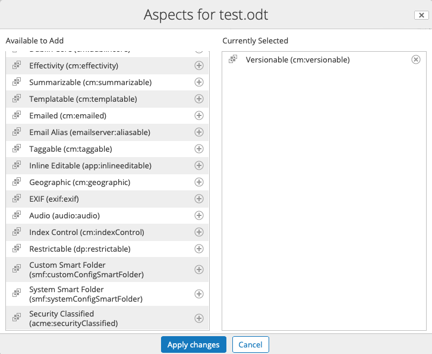
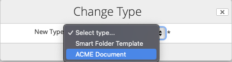
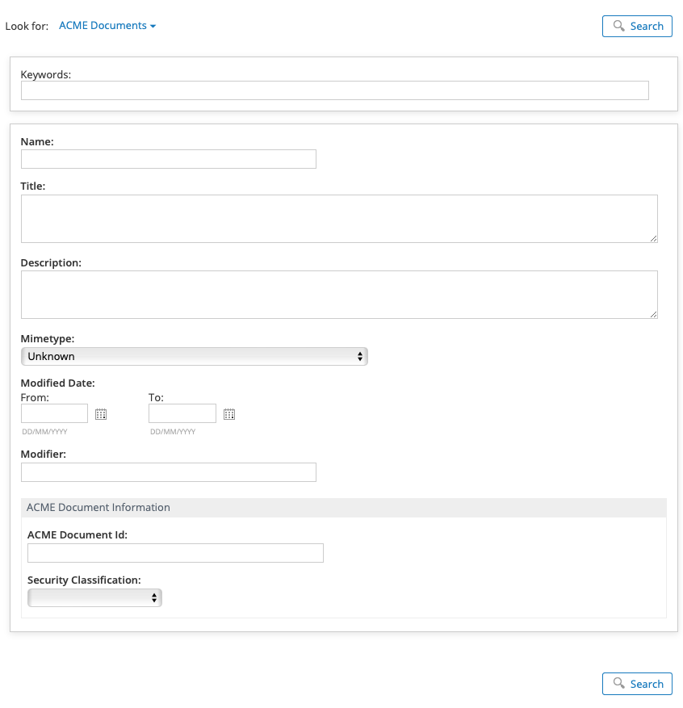
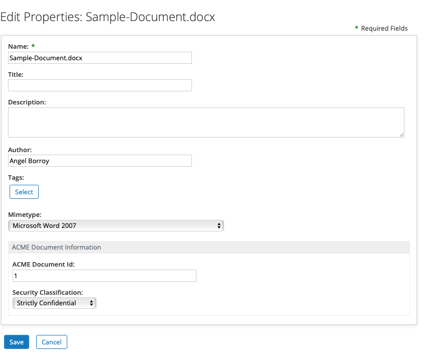
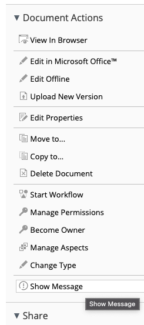
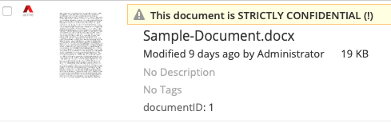
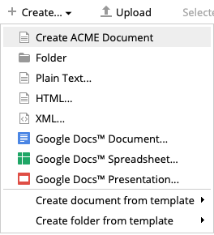
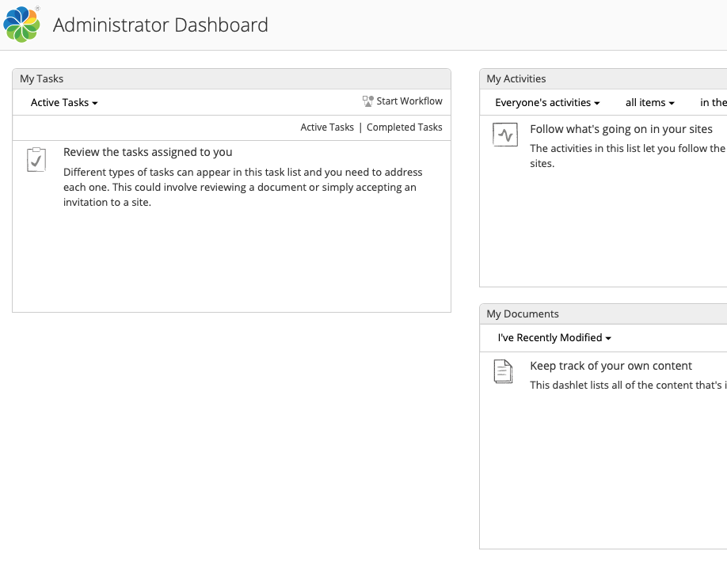
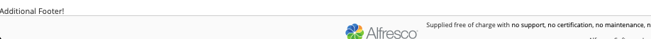

# Alfresco Share Extensions Catalog

*This project has been designed as a sample, don't use this code for prod environments*

Alfresco Share uses **FTL** ([FreeMarker](https://docs.alfresco.com/content-services/latest/develop/reference/freemarker-ref/)) components together with JavaScript [YUI](https://clarle.github.io/yui3/) for the view, [Spring Surf](https://docs.alfresco.com/content-services/latest/develop/reference/surf-framework-ref/) for controllers and [Share JavaScript API](https://docs.alfresco.com/content-services/latest/develop/reference/surf-framework-ref/#surfrootobjects) for server logic. Alternatively [Aikau](https://docs.alfresco.com/content-services/latest/develop/reference/aikau-intro-ref/) can be used for the view or [Share Java API](https://github.com/Alfresco/alfresco-community-share/tree/master/share/src/main/java/org/alfresco/web) for server logic.

Customizations are produced using [Alfresco Maven SDK](https://docs.alfresco.com/content-services/latest/develop/sdk/), that generates AMP or JAR artifacts to be deployed in Share webapp.

This project includes different folders to support the Share Extensions catalog

* [repo-extension](repo-extension) includes a custom Content Model `acme`
* [share-extension](share-extension) includes different Share Extensions
* [docker](docker) includes a Docker Compose template to deploy repo and share extensions

## [Share Configuration Extension Point](https://docs.alfresco.com/content-services/latest/develop/share-ext-points/share-config/)

The configurations typically goes into the [`share-config-custom.xml`](share-extension/src/main/resources/META-INF/share-config-custom.xml) file.

* Visibility of Aspects and Types (from custom content models like `acme`)

```xml
<config evaluator="string-compare" condition="DocumentLibrary">
    <aspects>
        <visible>
            <aspect name="acme:securityClassified"/>
        </visible>
        <addable> <!-- defaults to visible config -->
        </addable>
        <removeable> <!-- defaults to visible config -->
        </removeable>
    </aspects>
    <types>
        <!-- Define the ACME base doc type as descedent from cm:content -->
        <type name="cm:content">
            <subtype name="acme:document"/>
        </type>
    </types>
</config>
```

Aspects



Types




* Advanced Search

```xml
<config evaluator="string-compare" condition="AdvancedSearch" replace="true">
    <advanced-search>
        <forms>
            <!-- Standard out-of-the-box types -->
            <form labelId="search.form.label.cm_content" descriptionId="search.form.desc.cm_content">cm:content
            </form>
            <form labelId="search.form.label.cm_folder" descriptionId="search.form.desc.cm_folder">cm:folder</form>

            <!-- Custom type -->
            <form labelId="form.label.advancedsearch.acmeDocument"
                  descriptionId="form.description.advancedsearch.acmeDocument">acme:document
            </form>
        </forms>
    </advanced-search>
</config>
```



* Metadata forms (from custom content model)

```xml
<!-- View and Edit forms for acme:document -->
<config evaluator="node-type" condition="acme:document">
    <forms>
        <!-- Default form configuration for the cm:content type -->
        <form>
          ...
        </form>

        <!-- Document Library pop-up Edit Metadata form -->
        <form id="doclib-simple-metadata">
          ...
        </form>
        <!-- Document Library Inline Edit form -->
        <form id="doclib-inline-edit">
        </form>
    </forms>
</config>
<!-- Create and search forms for acme:document -->
<config evaluator="model-type" condition="acme:document">
    <forms>
        <form>
          ...
        </form>
        <!-- Search form -->
        <form id="search">
        </form>
    </forms>
</config>    
```



* Document Library actions, indicators and metadata templates

```xml
<config evaluator="string-compare" condition="DocLibActions">
    <actions>
        <action id="doclib.action.showCustomMessage"
                icon="showmsg"
                type="javascript"
                label="doclib.action.showCustomMessage.label">
            <param name="function">onShowCustomMessage</param>
            <evaluator>evaluator.AcmeEvaluator</evaluator>
        </action>
    </actions>
    <actionGroups>
        <actionGroup id="document-browse">
            <action index="402" id="doclib.action.showCustomMessage" />
        </actionGroup>
        <actionGroup id="document-details">
            <action index="402" id="doclib.action.showCustomMessage" />
        </actionGroup>
    </actionGroups>
</config>

<config evaluator="string-compare" condition="DocumentLibrary">
    <indicators>
        <indicator id="indicator.AcmeIndicator"
                   icon="acme-16.png"
                   index="100"
                   label="doclib.action.showCustomMessage.label">
            <evaluator>evaluator.AcmeEvaluator</evaluator>
        </indicator>
    </indicators>
</config>

<config evaluator="string-compare" condition="DocumentLibrary">
    <metadata-templates>
        <template id="acmeDocMetadataTemplate">
            <evaluator>evaluator.AcmeEvaluator</evaluator>
            <banner index="10" id="strictlyConfidential" evaluator="evaluator.doclib.metadata.strictlyConfidential">{strictlyConfidential}</banner>
            <line index="10" id="date">{date}{size}</line>
            <line index="20" id="description" view="detailed">{description}</line>
            <line index="30" id="tags" view="detailed">{tags}</line>
            <line index="40" id="acmeDocIdCustom" view="detailed">{acmeDocumentIdCustomRendition documentID}</line>
        </template>
    </metadata-templates>
</config>
```

Action



Indicator and Metadata Template




* Create content

```xml
<config evaluator="string-compare" condition="DocumentLibrary">
    <create-content>
        <content id="acme-plain-text" label="create.acmedoc.menu.item.label" icon="text" index="1" type="pagelink">
            <param name="page">create-content?destination={nodeRef}&amp;itemId=acme:document&amp;mimeType=text/plain</param>
        </content>
    </create-content>
</config>
```



Additional configuration options:

* Workflow task forms
* Visibility of workflow process definitions (that is, what workflows can be started)
* Themes
* Menu bar
* Repository location
* Sorting fields and labels
* Web Framework settings
* Data Lists
* Cross-site request forgery (CSRF) policy


## [Surf Extension Module](https://docs.alfresco.com/content-services/latest/develop/share-ext-points/surf-extension-modules/)

The configurations typically goes into a `*-extension.xml` file under `web-extension/site-data/extensions` folder, like [share-extension.xml](share-extension/src/main/resources/alfresco/web-extension/site-data/extensions/share-extension.xml)

* Add, Update, and Hide components on a Surf Page. This sample hides user dashborad:

```xml
<component>
  <region-id>component-1-1</region-id>
  <source-id>user/{userid}/dashboard</source-id>
  <scope>page</scope>
  <sub-components>
    <sub-component id="default">
      <evaluations>
        <evaluation id="guaranteedToHide">
          <render>false</render>
        </evaluation>
      </evaluations>
    </sub-component>
  </sub-components>
</component>
```



* Override Spring Surf Web Scripts

```xml
<!-- Customize Footer (FTL) -->
<customization>
  <targetPackageRoot>org.alfresco.components.footer</targetPackageRoot>
  <sourcePackageRoot>org.alfresco.customization.footer.template</sourcePackageRoot>
</customization>
<!-- Customize Live Search (Aikau) -->
<customization>
  <targetPackageRoot>org.alfresco</targetPackageRoot>
  <sourcePackageRoot>org.alfresco.customization.live.search</sourcePackageRoot>
  <alwaysApply>
    <webscript>share-header</webscript>
  </alwaysApply>
</customization>
```

Above sample (FTL) applies the changes described in [footer.get.html.ftl](share-extension/src/main/resources/alfresco/web-extension/site-webscripts/org/alfresco/customization/footer/template/footer.get.html.ftl) to Share footer.



Additionally, the Aikau extension modifies a widget property to avoid showing `person` results in Live Search box as described in [share-header.get.js](share-extension/src/main/resources/alfresco/web-extension/site-webscripts/org/alfresco/customization/live/search/share-header.get.js)


* Load Web Resources (CSS, JS)

```xml
<config evaluator="string-compare" condition="DocLibCustom">
  <dependencies>
    <js src="components/documentlibrary/custom-doclib-actions.js" />
    <js src="components/documentlibrary/custom-metadata-template-renderer.js"/>
  </dependencies>
</config>
```

Above sample register JavaScript action `onShowCustomMessage` and renderers `acmeDocumentIdCustomRendition` and `strictlyConfidential`

`custom-doclib-actions.js` implements the logic of the JavaScript action invoking a Share WebScript defined in folder [services](share-extension/src/main/resources/alfresco/web-extension/site-webscripts/org/alfresco/services), that invokes a Repository REST API using Share JavaScript API

```JavaScript
var connector = remote.connect("alfresco-api");
var result = connector.get("/-default-/public/alfresco/versions/1/people/" + args.userId);
```


* Keep different versions of a configuration package

```xml
<module>
  <id>share-extension</id>
  <version>1.0</version>
  <auto-deploy>true</auto-deploy>
  ...
</module>
```

Additional configuration options:

* Deploy and Un-Deploy configuration from UI
* Group configuration into named packages
* Override default Share configuration

## [Spring Beans](https://github.com/Alfresco/share/tree/master/share/src/main/resources/alfresco)

The configurations typically goes into a `*-context.xml` file under `web-extension` folder, like [share-extension-slingshot-application-context.xml](share-extension/src/main/resources/alfresco/web-extension/share-extension-slingshot-application-context.xml)

* Resource bundles, available in file [share-extension.properties](share-extension/src/main/resources/alfresco/web-extension/messages/share-extension.properties) 

```xml
<bean id="org.alfresco.share-extension.resources"
     class="org.springframework.extensions.surf.util.ResourceBundleBootstrapComponent">
  <property name="resourceBundles">
     <list>
        <value>alfresco.web-extension.messages.share-extension</value>
     </list>
  </property>
</bean>
```

* Evaluators, developed in Java like [AcmeEvaluator](share-extension/src/main/java/org/alfresco/evaluator/AcmeEvaluator.java) or customized from an existing one like `evaluator.doclib.action.value` 

```xml
<!-- Java backed evaluator -->
<bean id="evaluator.AcmeEvaluator" class="org.alfresco.evaluator.AcmeEvaluator" />
<!-- Out of the box evaluator -->
<bean id="evaluator.doclib.metadata.strictlyConfidential" parent="evaluator.doclib.action.value">
  <property name="accessor" value="node.properties.acme:securityClassification" />
  <property name="comparator">
     <bean class="org.alfresco.web.evaluator.StringEqualsComparator">
        <property name="value" value="Strictly Confidential" />
     </bean>
  </property>
</bean>
```

Additional configuration options:

* Java backed Share WebScripts
